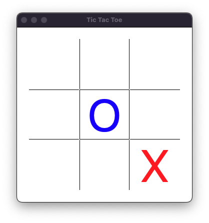
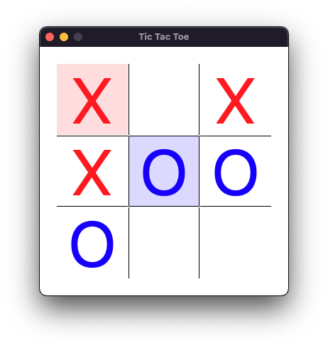

# Tic Tac Toe

## About
This is a simple infinite Tic Tac Toe game built with [Wails](https://github.com/wailsapp/wails) (`Go` + `Svelte` + `Typescript`).

## Build
```shell
$ wails build -clean
```

## How to play
Starting from the 4th move, the earliest placed markers will be moved to different positions on the board.
The marker with the background color will move on the next click.


